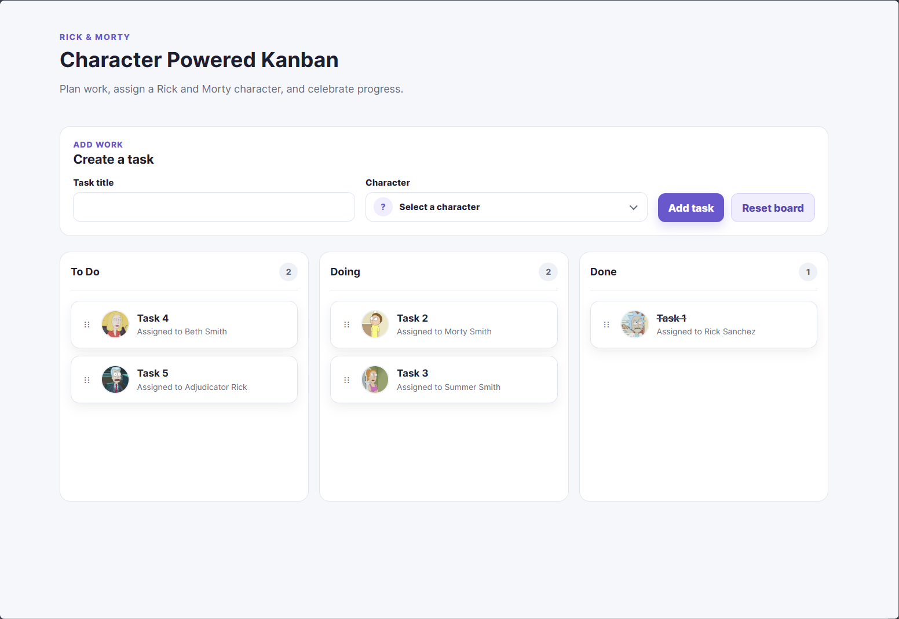

# Rick & Morty Kanban Board

An interactive Kanban board powered by characters from the [Rick and Morty GraphQL API](https://rickandmortyapi.com/graphql).

## Preview

<p align="center">
  
</p>

The project is intentionally frontend-only: board state is stored in the browser, so it can be explored without authentication or a backend service.

## Features

- Create tasks with a title and an assigned Rick and Morty character.
- Validate required fields with accessible error states.
- Browse characters in an avatar-based combobox with lazy-loaded images.
- Drag tasks across columns and reorder them within a column.
- Support pointer and keyboard drag-and-drop interactions.
- Show an insertion preview while dragging without shifting the page layout.
- Strike through completed task titles and celebrate completed work with colorful confetti.
- Delete individual tasks or reset the entire board.
- Persist the board in versioned `localStorage`.
- Provide a responsive layout with horizontally scrollable Kanban columns on small screens.

## Tech stack

- React 19 and TypeScript
- Vite
- `@dnd-kit/react` for accessible drag-and-drop interactions
- GraphQL requests to the Rick and Morty API
- CSS Modules
- Vitest and Testing Library

## Run locally

Requirements: Node.js 20.19+ or 22.12+ and npm.

```bash
npm install
npm run dev
```

Open the local URL printed by Vite.

## Board persistence

Tasks are stored under the browser key `rick-morty-kanban:board:v1`.

This means tasks survive page refreshes and development-server restarts for the same browser origin. The data is local to the current browser and is not shared with other users or devices. Use **Reset Board** to remove all tasks and clear the saved board state.

## Architecture

```text
src/
├── app/                         application composition
├── features/
│   ├── characters/              GraphQL API and character view models
│   └── board/
│       ├── components/          form, columns, cards, avatars, celebration
│       ├── dnd/                 drag-event and insertion helpers
│       └── state/               reducer, domain types, persistence
├── index.css                    global design tokens and primitives
└── main.tsx                     application entry point
```

- `src/features/characters` owns the API boundary, response validation, loading state, retry behavior, and character view models.
- `src/features/board/components` contains focused presentational components.
- `src/features/board/state` contains the pure board reducer, domain types, and local persistence adapter.
- `KanbanBoard` coordinates board state, drag lifecycle events, and completion celebration.
- Dragging is controlled through React state: `onDragStart` snapshots the board, `onDragOver` applies movement, and `onDragEnd` finalizes or safely falls back. This keeps React as the source of truth and avoids DOM ownership conflicts.
- CSS Modules keep feature styles local; global CSS contains only shared tokens and primitives.

## Verification

```bash
npm run test
npm run typecheck
npm run lint
npm run build
```

The current suite covers board state transitions, drag-and-drop behavior, persistence, form validation, character loading, and UI components.
